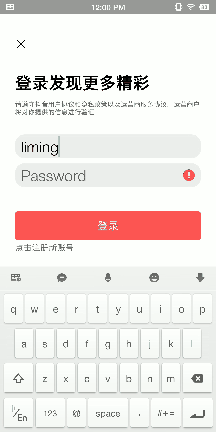

# douyin

##  Completed API:
+ douyin/user/*
+ douyin/relation/*
##  demo show 
+ relation



## Quick Start
### Setup Basic Dependence
```
docker-compose up
```

### Run User RPC Server
```
cd cmd/user
sh build.sh
sh output/bootstrap.sh
```
### Run Relation RPC Server
```
cd cmd/relation
sh build.sh
sh output/bootstrap.sh
```

### Run API Server
```
cd cmd/api
go run .
```

### Jaeger
Visit http://127.0.0.1:16686/ on browser

### Grafana
Visit http://127.0.0.1:3000/ on browser

## API Requests
The following is a list of API requests and partial responses.

### Register
```
curl --location --request POST '127.0.0.1:8080/douyin/user/register' \
--header 'Content-Type: application/json' \
--data-raw '{
    "username":"lorain",
    "password":"123456"
}'
```
#### response
```
// successful
{
    "code": 0,
    "message": "Success",
    "data": null
}
```
```
// failed
{
    "code": 10003,
    "message": "User already exists",
    "data": null
}
```
### Login
will return jwt token
```
curl --location --request POST '127.0.0.1:8080/douyin/user/login' \
--header 'Content-Type: application/json' \
--data-raw '{
    "username":"lorain",
    "password":"123456"
}'
```
### response

```
// successful
{
    "code": 0,
    "expire": "2022-12-3T01:56:46+08:00",
    "token": "xxx.xxx.xxx"
}
```
```
// failed
{
    "code": 10004,
    "message": "Authorization failed",
    "data": null
}
```


relation :
/douyin/relation/action/?token=limingliming&to_user_id=1&action_type=1

/douyin/relation/follow/list/?token=limingliming&user_id=2"

/douyin/relation/follower/list/?token=limingliming&user_id=2"

/douyin/relation/friend/list/?token=limingliming&user_id=2
